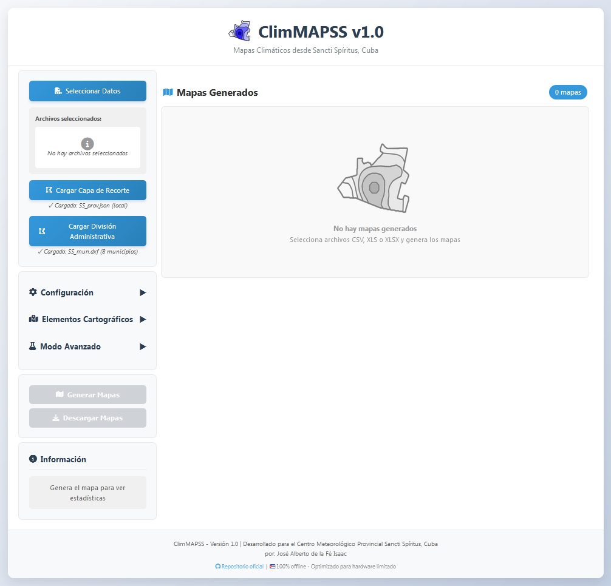
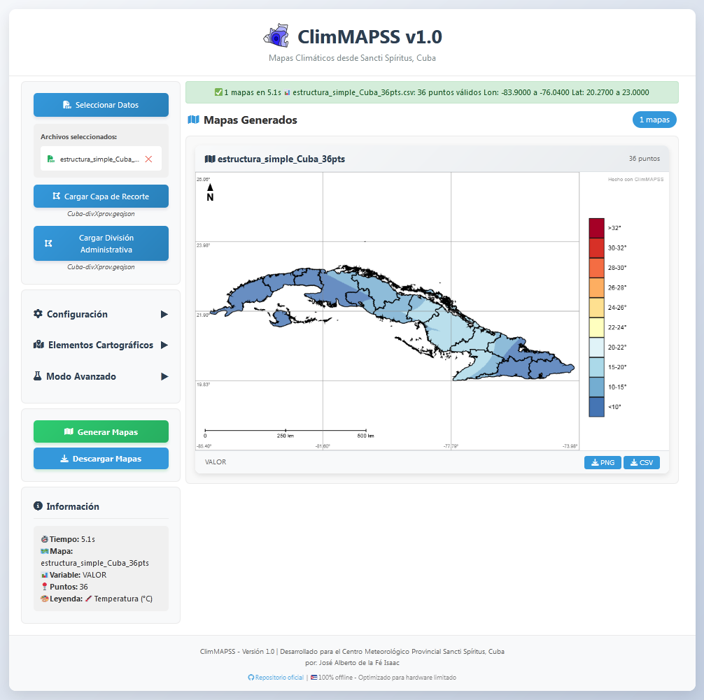
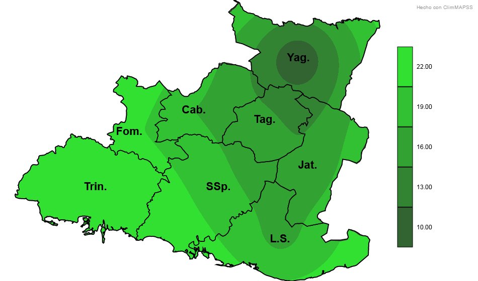
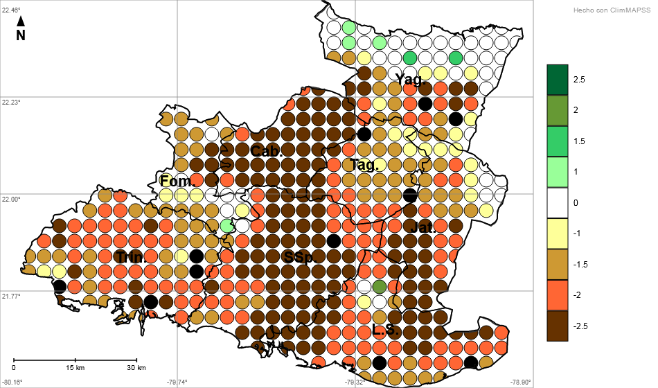
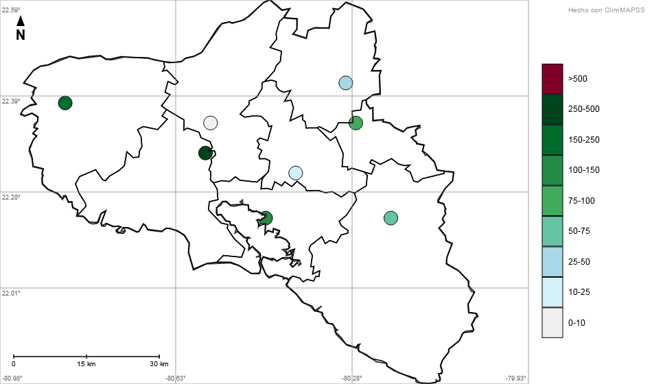
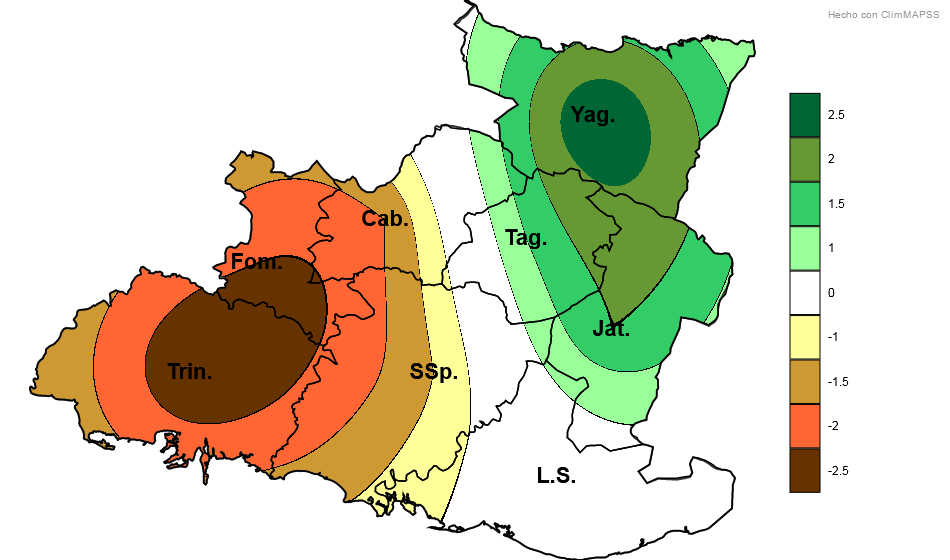
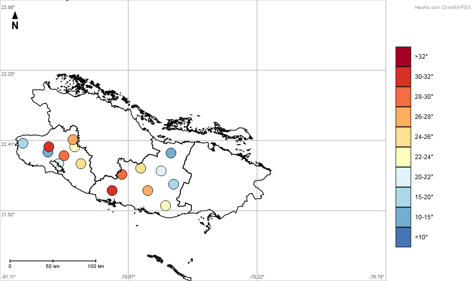
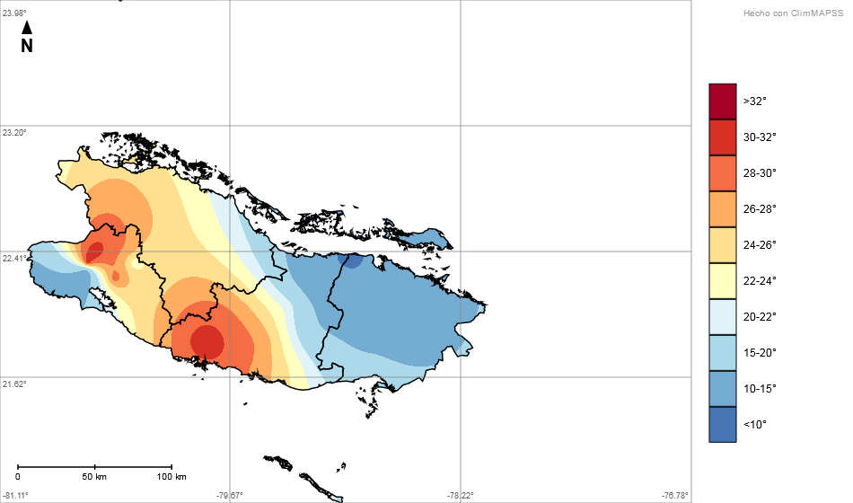
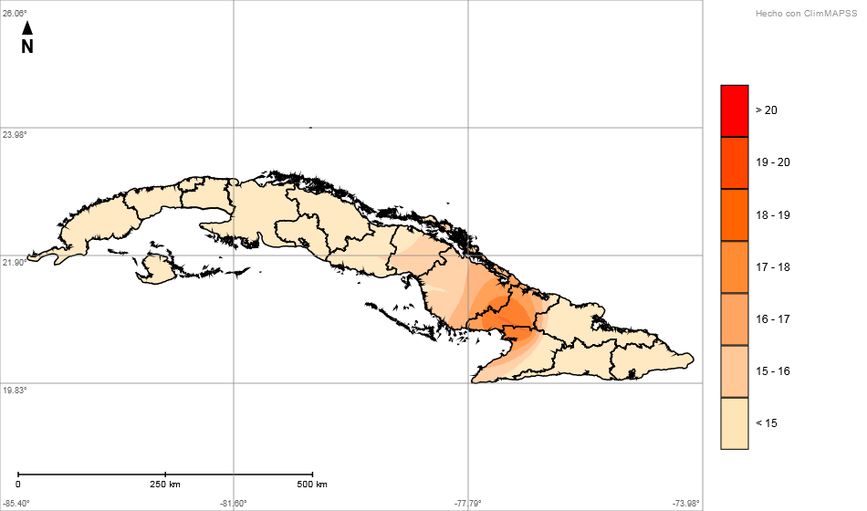
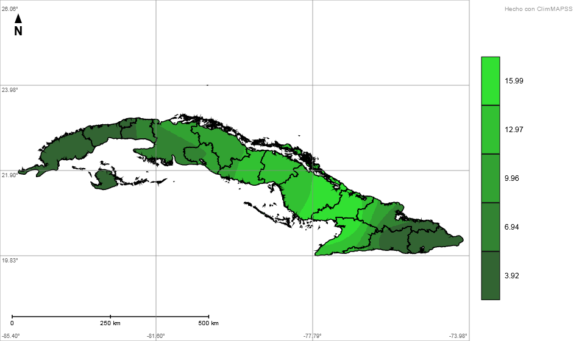

# 🌦️ ClimMAPSS v1.0

| Al iniciar                                          | Con mapa de Cuba generado                      |
|-----------------------------------------------------|------------------------------------------------|
|  |  |

**MiniSIG liviano para meteorología** – 100% offline 

> Desarrollado por José Alberto de la Fé Isaac  
> Centro Meteorológico Provincial Sancti Spíritus, Cuba

---

## 📋 Tabla de contenidos

- [¿Qué es ClimMAPSS?](#qué-es-climmapss)
- [Requisitos](#requisitos)
- [Instalación](#instalación)
- [Primeros pasos](#primeros-pasos)
- [Archivos de ejemplo](#archivos-de-ejemplo)
- [Formatos soportados](#formatos-soportados)
- [Rendimiento](#rendimiento)
- [Personalización avanzada](#personalización-avanzada)
- [Galería de mapas](#galería-de-mapas)
- [Solución de problemas](#solución-de-problemas)
- [Créditos y licencias](#créditos-y-licencias)
- [Manual completo](#manual-completo)

---

## ¿Qué es ClimMAPSS?

ClimMAPSS es un Sistema de Información Geográfica (SIG) de bajo costo computacional, diseñado específicamente para funcionar en equipos con recursos limitados (2GB RAM, Intel Atom) y en condiciones de total desconexión de internet.

Genera mapas interpolados (SPI, temperatura, precipitación, etc.) a partir de archivos CSV o Excel, sin necesidad de instalar nada.

**Características principales:**

- ✅ 100% OFFLINE (no necesita internet)
- ✅ NO se instala (solo abres un archivo)
- ✅ Corre en equipos con recursos limitados (2GB RAM)
- ✅ Respeta tu privacidad (los datos NUNCA salen de tu PC)

ClimMAPSS está diseñado específicamente para hardware limitado. Corre en equipos con 2GB de RAM y procesadores Intel Atom, donde otros SIG (como ArcGIS Pro o QGIS con complementos avanzados) simplemente no funcionan o van demasiado lentos.

---

## Requisitos

| Componente        | Mínimo                  | Recomendado         |
|-------------------|-------------------------|---------------------|
| RAM               | 2GB                     | 4GB                 |
| Procesador        | Intel Atom              | Core i3/i5/i7 o AMD |
| Espacio en disco  | 50MB                    | 100MB               |
| Navegador         | Firefox (recomendado)   | Firefox             |
| Sistema operativo | Windows / Linux / macOS | Cualquiera          |

### ⚠️ Navegador recomendado

**Firefox es el navegador recomendado.** Chrome puede mostrar tiempos de ejecución incorrectos (menores a los reales) en interpolaciones largas.

| Navegador | Comportamiento                                    |
|-----------|---------------------------------------------------|
| Firefox   | ✅ Tiempos reales, estable                        |
| Chrome    | ⚠️ Puede mostrar tiempos falsos en resolución 1px |
| Edge / IE | ❌ No funciona                                    |

---

## Instalación

1. Descargar `ClimMAPSS_v1.0.zip`
2. Extraer en cualquier carpeta
3. Abrir `ClimMAPSS_v1.0.html` en el navegador
4. ¡Listo! No requiere configuración adicional

> ⚠️ Mantener la estructura de carpetas original. No mover archivos individualmente.

---

## Primeros pasos

### 1. Cargar datos
- Botón "Seleccionar Datos" → uno o varios archivos CSV o Excel
- Deben tener columnas `LON` y `LAT` (grados decimales)

### 2. Cargar capas geográficas
- **Capa de Recorte (OBLIGATORIA):** Define los límites del mapa
- **División Administrativa (OPCIONAL):** Dibuja municipios, distritos
- Si no cargas nada, ClimMAPSS usa Sancti Spíritus (precargado)

### 3. Configurar el mapa
- **Método:** Kriging (preciso), IDW (rápido) o Mapa de Puntos
- **Resolución:** `1px` (calidad máxima) o `10px` (rápido)
- **Leyenda:** SPI, Temperatura, Precipitación, Automática o Personalizada (JSON)

### 4. Generar y exportar
- Botón "Generar Mapas"
- Descarga PNG (individual o todos) o CSV de la malla interpolada

---

## Archivos de ejemplo

La carpeta `ejemplo-datos/` incluye archivos para probar las diferentes funcionalidades:

| Archivo                                | Pts | Variables | Uso                    |
|----------------------------------------|-----|-----------|------------------------|
| `estructura_simple_SSP-8pts-1.xlsx`    | 8   | 1         | Modo lote              |
| `estructura_simple_SSP-8pts-2.csv`     | 8   | 1         | Modo lote              |
| `estructura_simple_Cuba_36pts.csv`     | 36  | 1         | Recorte con GeoJSON    |
| `estructura_simple_SSP-450pts.csv`     | 450 | 1         | Pruebas de rendimiento |
| `estructura_complejo_SSP+CFG-8pts.csv` | 16  | Múltiples | Filtros, variables     |

**Carpeta `ejemplo-geojson/`** (recorte y división administrativa):
- GeoJSON de todas las provincias y municipios (cortesía de Yudivián Almeida Cruz)
- `cuba_completa.geojson` y `region_central.geojson` (modificados por ClimMAPSS)

**Carpeta `ejemplo-leyendas-json/`** (escalas personalizadas):
- `Leyenda-RR-ejemplo.json` – Precipitación
- `Leyenda-Rg-ejemplo.json` – Radiación
- `Leyenda-Tm-ejemplo.json` – Temperatura media
- `Leyenda-VV-ejemplo.json` – Velocidad del viento

### Modo lote (varios archivos a la vez)

Para series temporales (SPI1, SPI3, SPI6...):
1. Mantén Ctrl (Windows) o Cmd (Mac)
2. Selecciona los archivos con la **misma estructura**
3. Haz clic en "Generar Mapas"

> ⚠️ Todos los archivos deben tener las mismas columnas, mismo delimitador y mismo tipo de datos. En el caso de variables SPI se permite que tengan nombres distintos (SPI1, SPI3, SPI6...).

---

## Formatos soportados

### Datos (CSV o Excel)
| Columna requerida  | Descripción                  | Ejemplo |
|--------------------|------------------------------|---------|
| LON / Longitud / x | Longitud en grados decimales | -79.5   |
| LAT / Latitud / y  | Latitud en grados decimales  | 21.8    |
| (variable)         | Valor numérico (T, RR, etc.) | 25.5    |

**Delimitadores soportados:** coma (`,`), punto y coma (`;`), tabulación (`\t`), espacio (` `)

### Capas geográficas (opcional)
| Formato    | Uso                                             | Botón en interfaz |
|------------|-------------------------------------------------|-------------------|
| GeoJSON    | Recorte / División (.geojson, .json)            | Ambos             |
| Shapefile  | Recorte / División (Necesita los TRES archivos (.shp + .shx + .dbf) comprimidos en .zip) | Ambos             |
| DXF (.dxf) | Recorte / División                              | Ambos             |
| BLN (.bln) | Recorte / División                              | Ambos             |

---

## Rendimiento

### Hardware de prueba
- **CPU:** Intel Atom N270 (32 bits, 1.6 GHz) – el escenario más lento
- **RAM:** 2GB
- **Navegador:** Firefox

### Tabla de tiempos reales

| Método  | Puntos | Resolución | Tiempo          |
|---------|--------|------------|-----------------|
| Kriging | 8      | 10px       | 0.26s           |
| Kriging | 8      | 1px        | 7.3s            |
| Kriging | 450    | 10px       | 16.0s           |
| Kriging | 450    | 1px        | 65.0s           |
| IDW     | 8      | 10px       | 0.55s           |
| IDW     | 8      | 1px        | 29.5s           |
| IDW     | 450    | 10px       | 12.0s           |
| IDW     | 450    | 1px        | 950s (15.8 min) |

> **Nota:** Estos tiempos fueron medidos en el equipo más lento disponible. Si tu computadora es más moderna, los tiempos serán más cortos.

### Recomendaciones

| Puntos        | Recomendación                 |
|---------------|-------------------------------|
| < 100         | Kriging 1px (calidad máxima)  |
| 100 - 500     | Kriging 1px o IDW 10px        |
| 500 - 1.500   | IDW 10px                      |
| 1.500 - 4.000 | IDW 10px (evitar Kriging 1px) |
| > 4.000       | Mapa de Puntos (modo malla)   |

---

## Personalización avanzada

### Crear tu propia leyenda (JSON)

Ejemplo mínimo:

```json
{
    "nombre": "Mi escala",
    "variable": "rr",
    "rangos": [
        { "min": -1e99, "max": 0, "color": "rgb(255,255,255)", "label": "0" },
        { "min": 0, "max": 10, "color": "rgb(200,230,255)", "label": "0-10" },
        { "min": 10, "max": 1e99, "color": "rgb(0,0,150)", "label": ">10" }
    ]
}
```
**Reglas:**
- Los rangos deben ir en orden (de menor a mayor valor)
- Usa `-1e99` para "menos infinito" y `1e99` para "más infinito"
- Cada rango necesita: `min`, `max`, `color`, `label`
- Colores en formato `rgb(r,g,b)` o hexadecimal `#RRGGBB`

Cómo cargarla: Leyenda → "Cargar leyenda personalizada" → seleccionar JSON
Cambiar nombres de municipios (para otras provincias)

Editar js/datos_locales.js:
```javascript

window.nombresMunicipios = ["Municipio 1", "Municipio 2", ...];
window.posicionesNombres = [
    { x: -80.45, y: 22.15 },
    { x: -80.33, y: 22.28 }
];
```
## 🖼️ Galería de mapas

A continuación, algunos ejemplos reales de mapas creados con ClimMAPSS
utilizando los archivos incluidos en la carpeta `ejemplo-datos/`.

---

### 🔹 Lote de dos archivos (escala automática)

**Archivos:** `estructura_simple_SSP-8pts-1.xlsx` y `estructura_simple_SSP-8pts-2.csv`  
**Método:** Kriging  




> Ambos generados en lote (misma estructura, misma variable). Escala automática.

---

### 🔹 Sancti Spíritus – 450 puntos

**Archivo:** `estructura_simple_SSP-450pts.csv`  

**Método:** Scatter (Mapa de Puntos)  



*Malla regular de 450 puntos dentro del territorio de Sancti Spíritus, coloreados según la leyenda de SPI.*

**Método:** Kriging a 10px  


*En este mapa se observan píxeles negros debido al anti-aliasing del canvas por el alto contraste de colores.*

---

### 🔹 Cienfuegos – 8 puntos (con filtro por provincia)

**Archivo:** `estructura_complejo_SSP+CFG-8pts.csv`  
**Capa de recorte:** GeoJSON de Cienfuegos  
**Filtro:** provincia = "Cienfuegos"

**Método:** Scatter (Mapa de Puntos) – Variable RR  



**Método:** IDW a 10px – Variable Temperatura  


---

### 🔹 Sancti Spíritus – 8 puntos (variable SPI)

**Archivo:** `estructura_complejo_SSP+CFG-8pts.csv`  
**Método:** Kriging a 1px  



> De este mapa se exportó el CSV de la malla para las pruebas de regeneración.

---

### 🔹 Regeneración de malla CSV (desde CSV exportado)

**Malla exportada desde ClimMAPSS (1px) y regenerada a 1px**  


**Malla exportada desde ClimMAPSS (1px) y regenerada a 10px**  

.png)

> ⚠️ No se puede regenerar una malla exportada a 10px en resolución 1px (la app respeta la resolución original del CSV).

---

### 🔹 Región central – 8 puntos (variable Temperatura)

**Archivo:** `estructura_complejo_SSP+CFG-8pts.csv`  
**Capa de recorte:** `region_central.geojson`

**Método:** Scatter (Mapa de Puntos)  



**Método:** Kriging  



---

### 🔹 Cuba completa – 36 puntos

**Archivo:** `estructura_simple_Cuba_36pts.csv`  
**Capa de recorte:** `cuba_completa.geojson`  
**Leyenda:** `Leyenda-Rg-ejemplo.json` (Radiación)

**Método:** Kriging  



**Malla exportada (1px) regenerada con escala automática**  



> En la regeneración con escala automática se aprecia un cambio visual respecto al mapa original.

---

## Solución de problemas

| Problema                                   | Solución                                              |
|--------------------------------------------|-------------------------------------------------------|
| Los puntos no se ven                       | Aplicar filtro por provincia                          |
| El mapa tarda mucho                        | Cambiar a resolución 10px                             |
| Tildes raras                               | Guardar CSV como UTF-8                                |
| El filtro no aparece                       | Agregar columna de texto (provincia, municipio)       |
| Kriging no termina (>1.800 pts)            | Usar IDW 10px                                         |
| Chrome se congela o muestra tiempos falsos | Cambiar a Firefox                                     |
| Interfaz sin iconos                        | Normal (sin internet), la app sigue funcionando       |

### Advertencia del navegador ("página no responde")

Es **normal** en mapas grandes. Hacer clic en "Esperar" o "Continuar". **No cerrar la pestaña.**

---

## Créditos y licencias

**Desarrollador:** José Alberto de la Fé Isaac – Centro Meteorológico Provincial Sancti Spíritus, Cuba

**Librerías:**
- Kriging.js (MIT) – Modificado para navegador
- Turf.js (MIT) – Incluye MarchingSquares.js (AGPL v3, sin modificar)
- shp.js (MIT)
- SheetJS / XLSX (Apache License 2.0)
- object-assign (MIT)
- splaytree (MIT)

**Datos geográficos:** GeoJSON de Cuba © Yudivián Almeida Cruz (MIT License)

### Marcas y propiedad intelectual

El nombre **"ClimMAPSS"** y sus logotipos (incluyendo las variaciones `ClimMAPSS-logo-rr.png`, `ClimMAPSS-logo-spi.png` y `ClimMAPSS-logo-gris.png`) son propiedad de José Alberto de la Fé Isaac.

Estos elementos no están cubiertos por la licencia MIT del código. Si deseas usar el nombre o el logotipo en un proyecto derivado o con fines comerciales, necesitas autorización expresa del autor.

### Licencia de ClimMAPSS

ClimMAPSS se distribuye bajo **MIT License**. Ver archivo `LICENSE` para texto completo.

---

## Manual completo

Para un **manual de usuario detallado** (paso a paso, ejemplos, solución de problemas, creación de leyendas JSON, etc.), consulta el archivo `INSTRUCCIONES.txt` incluido en el ZIP.

---

## Versión

**ClimMAPSS v1.0 – Abril 2026**

---

## ¡Gracias por usar ClimMAPSS!

Repositorio: https://github.com/JoseDLFI/climmapss
